# heis 小说采集与发布系统 — 小白安装部署教程

> 一份从「零基础」到「上线运营」的全流程图文教程。涵盖本地开发、6 个 mini-services 桥接、Docker 一键部署、采集规则导入、任务监控、站群主题、读者页配置与常见问题排查。
>
> 适用版本：heis v0.2.x（Next.js 16 + Turbopack + Prisma/SQLite + Bun runtime）
> 仓库地址：https://github.com/u4399com-beep/heis

## 📖 目录

1. [环境准备](#1-环境准备)
2. [获取源码](#2-获取源码)
3. [安装依赖](#3-安装依赖)
4. [配置环境变量](#4-配置环境变量)
5. [初始化数据库](#5-初始化数据库)
6. [启动服务](#6-启动服务)
7. [首次登录与配置](#7-首次登录与配置)
8. [导入采集规则](#8-导入采集规则)
9. [创建采集任务](#9-创建采集任务)
10. [监控采集进度](#10-监控采集进度)
11. [站群系统配置](#11-站群系统配置)
12. [主题选择](#12-主题选择)
13. [公开站点预览](#13-公开站点预览)
14. [Docker 一键部署](#14-docker-一键部署生产环境推荐)
15. [常见问题 FAQ](#15-常见问题-faq)

---

## 1. 环境准备

### 1.1 必需软件清单

| 软件 | 最低版本 | 推荐版本 | 用途 | 官方下载 |
| --- | --- | --- | --- | --- |
| **Bun** | 1.3.0 | 1.3.x 最新 | 主应用开发与构建运行时 | https://bun.sh |
| **Node.js** | 22.0.0 | 22.x LTS | 生产容器内运行时（开发可不需要） | https://nodejs.org |
| **Git** | 任意现代版本 | 2.40+ | 拉取源码 | https://git-scm.com |
| **Python** | 3.12.0 | 3.12.x | 仅 `scrapling-bridge`（3012 端口）需要 | https://www.python.org |
| **uv** | 0.4+ | 最新 | Python 虚拟环境管理（推荐） | https://docs.astral.sh/uv |
| **Docker** | 24.0 | 最新 | 生产环境一键部署（见第 14 章） | https://www.docker.com |

> 💡 **本地开发**只需 Bun + Git 即可启动；Python 仅在你要采集「霹雳书屋」等带 Cloudflare 挑战的站点时才需要。

### 1.2 安装 Bun

**macOS / Linux（一行安装）：**

```bash
curl -fsSL https://bun.sh/install | bash
```

**Windows（PowerShell）：**

```powershell
irm bun.sh/install.ps1 | iex
```

**Windows WSL（推荐）：**

```bash
# 进入 WSL 后同 Linux 安装命令
curl -fsSL https://bun.sh/install | bash
```

安装完成后**关闭并重新打开终端**，让 PATH 生效。

### 1.3 安装 Git

```bash
# Ubuntu / Debian
sudo apt update && sudo apt install -y git

# CentOS / RHEL / Fedora
sudo dnf install -y git

# macOS（系统自带，缺失时执行）
xcode-select --install

# Windows：前往 https://git-scm.com/download/win 下载安装包，一路「下一步」即可
```

### 1.4 安装 Python（可选，仅 scrapling 桥需要）

```bash
# Ubuntu / Debian
sudo apt install -y python3 python3-pip python3-venv

# macOS（建议用 Homebrew）
brew install python@3.12

# 安装 uv（替代 pip，速度快且更省事）
curl -LsSf https://astral.sh/uv/install.sh | sh
```

### 1.5 验证安装结果

打开终端，逐条执行下面四条命令：

```bash
bun --version
node --version
git --version
python3 --version
```

如果四条命令都返回了版本号（不报 `command not found`），说明环境准备完成。预期输出示例：

```
$ bun --version
1.3.14
$ node --version
v24.19.0
$ git --version
git version 2.43.0
$ python3 --version
Python 3.12.14
```

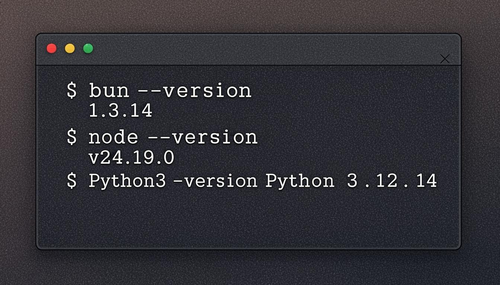

> ⚠️ **国内网络提示**：如 `bun.sh` 或 `python.org` 访问慢，可在命令前加代理：`export https_proxy=http://127.0.0.1:7890` 后再执行安装。Bun 亦提供国内镜像：`curl -fsSL https://bun.sh/install | BUN_INSTALL=$HOME/.bun bash -s -- --registry=https://registry.npmmirror.com`。

---

## 2. 获取源码

### 2.1 克隆仓库

打开终端，切换到你希望存放项目的目录（例如 `~/code`），执行：

```bash
git clone https://github.com/u4399com-beep/heis.git novel-system
cd novel-system
```

> 国内 GitHub 直连慢？可任选一种加速方式：
> - 加速代理：`git clone https://ghproxy.net/https://github.com/u4399com-beep/heis.git novel-system`
> - 镜像站：`git clone https://gitclone.com/github.com/u4399com-beep/heis.git novel-system`
> - 配置一次性代理：`git -c http.proxy=http://127.0.0.1:7890 clone https://github.com/u4399com-beep/heis.git`

### 2.2 项目结构概览

克隆完成后，执行 `ls -la` 应看到如下目录结构：

```
heis/
├── src/                    # Next.js App Router 源码
│   ├── app/                # 路由：/api/admin /api/public + 前台页面
│   ├── components/         # 业务组件 + ui/(shadcn 完整组件库)
│   └── lib/crawl/          # 采集引擎核心（fetcher/parser/cleaner/runner/...）
├── prisma/                 # Prisma schema + 数据库文件
├── mini-services/          # 6 个支撑服务（端口 3010-3015）
├── scripts/                # 种子脚本 + 验证脚本
├── docker/                 # autofill 自动填充引导
├── docs/                   # 文档
├── package.json            # 主应用依赖与脚本
├── .env.example            # 环境变量模板
├── Dockerfile              # 生产镜像构建
├── docker-compose.yml      # 编排文件
├── install.sh              # Docker 一键部署脚本
└── README.md               # 项目总览
```

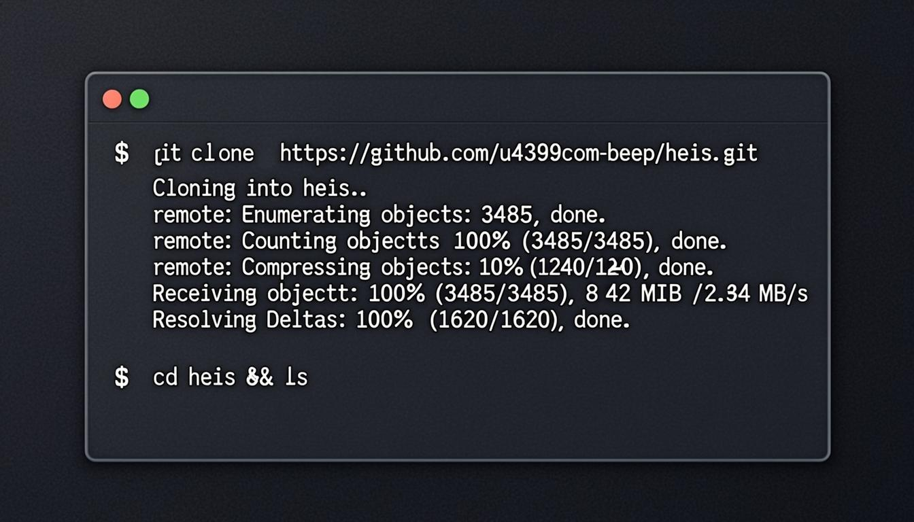

---

## 3. 安装依赖

### 3.1 安装主应用依赖

在项目根目录执行：

```bash
bun install
```

第一次安装约需 10~30 秒，会拉取约 542 个包。完成后会看到类似输出：

```
$ bun install
+ @prisma/client@6.19.2
+ next@16.1.3
+ prisma@6.11.1
+ playwright@1.62.1
+ react@19.0.0
+ cheerio@1.2.0
+ sharp@0.34.3
...
542 packages installed [12.34s]
```

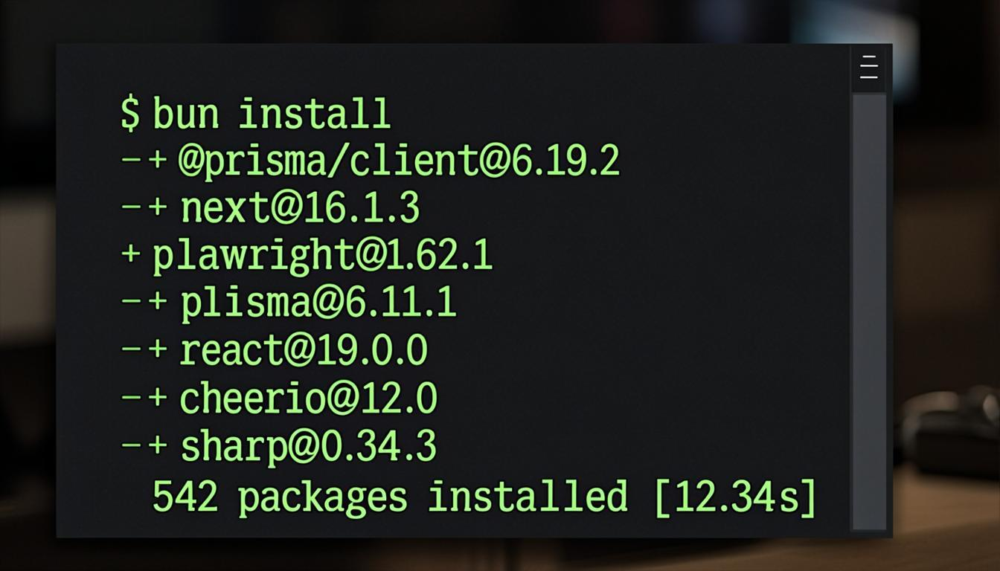

### 3.2 安装 mini-services 依赖

6 个 mini-services 各有独立的 `package.json`，需要分别安装（仅 `@types/bun` 一个 devDep，安装很快）：

```bash
# 共享桥样板（被其他 5 个 Bun 服务引用）
cd mini-services/_shared && bun install && cd ../..

# 5 个 Bun 代理服务
for svc in bqg713-proxy fetch-relay qimao-proxy deqixs-proxy xjp-proxy; do
  echo "→ installing $svc ..."
  (cd "mini-services/$svc" && bun install)
done
```

### 3.3 安装 scrapling-bridge Python 依赖（可选）

> 仅当你需要采集**带 Cloudflare 挑战的站点**（如「霹雳书屋」）时才需要执行本节。普通用户可跳过。

```bash
cd mini-services/scrapling-bridge

# 推荐用 uv 创建虚拟环境（速度快、隔离干净）
uv venv .venv
uv pip install --python .venv/bin/python 'scrapling[fetchers]'

# 安装 patchright/chromium 浏览器内核（约 200MB 下载）
.venv/bin/scrapling install

cd ../..
```

> 如果没有 uv，也可以用传统 pip：`python3 -m venv .venv && .venv/bin/pip install 'scrapling[fetchers]' && .venv/bin/scrapling install`

### 3.4 安装 Playwright 浏览器内核（可选）

主应用依赖 `playwright@1.62.1`，但浏览器内核默认不下载。如你需要本地启用 **Obscura 隐身渲染**（采集引擎最高级降级链，用于破解高防站点），执行：

```bash
bunx playwright install chromium
```

> 不安装也不会影响普通采集——引擎会自动降级到 native fetch / curl / fetch-relay 链路。

### 3.5 验证 mini-services 各依赖

确保每个目录下都生成了 `node_modules/`：

```bash
ls -d mini-services/*/node_modules
# 预期输出 6 行（_shared + 5 个 Bun 服务；scrapling-bridge 是 Python，无 node_modules）
```

---

## 4. 配置环境变量

### 4.1 复制模板

```bash
cp .env.example .env
```

### 4.2 编辑 `.env` 文件

用任意编辑器（VSCode / nano / vim）打开 `.env`，按需修改。**最关键的四项**如下：

```env
# ===== 数据库 =====
# SQLite 文件路径，相对项目根目录。默认即可，Docker 部署时由 compose 改为 /app/db/custom.db
DATABASE_URL=file:./db/custom.db

# ===== 后台鉴权 =====
# 后台登录密码（生产环境务必修改！默认值 audit-fix-2025 仅用于首次登录演示）
ADMIN_PASSWORD=audit-fix-2025

# 会话签名密钥（留空则由 ADMIN_PASSWORD 派生 SHA256；改密即令所有会话失效）
SESSION_SECRET=

# ===== 日志 =====
# 结构化日志级别：debug / info / warn / error
# - debug: 开发默认，含每条 incoming request 日志
# - info:  生产推荐，仅业务关键事件 + health 收集
# - warn:  仅警告（批量错误、降级链触发等）
# - error: 仅未捕获异常 / DB 失败
LOG_LEVEL=info
```

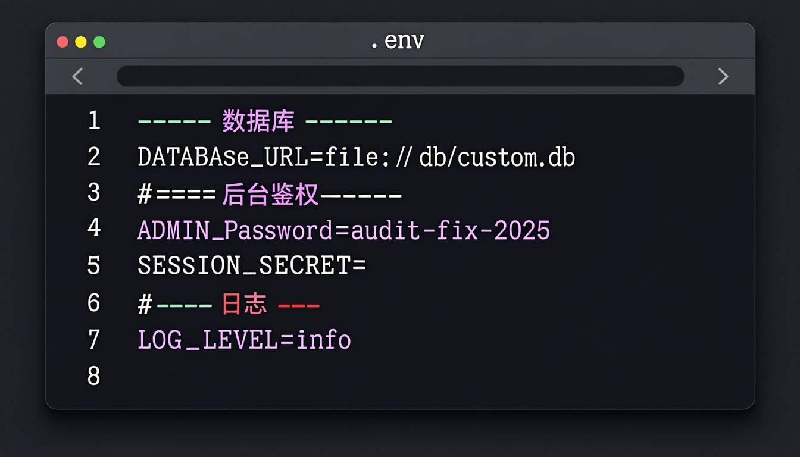

### 4.3 高级变量（按需开启）

`.env.example` 中以 `#` 开头的项是可选高级项，未设时各模块自行回落默认值（零回归）。常用的几个：

| 变量名 | 作用 | 示例值 |
| --- | --- | --- |
| `BRIDGE_KEY` | mini-services 桥接共享密钥（多主机部署时启用，单机留空即可） | `my-bridge-secret-32-chars` |
| `OBSCURA_CONCURRENCY` | Obscura 隐身渲染页面池并发上限（默认 2，提高=更快但更耗内存） | `4` |
| `AUTO_FILL` | Docker 装完后是否自动导入规则并启动填充任务 | `1` 或 `0` |
| `AUTO_FILL_RULES` | 参与自动填充的站点 key 清单（逗号分隔） | `fanqie,qimao,deqixs,bqg713,xjp,80ge,jinghua` |
| `HOST_PORT` | 宿主机端口（用于占用检测；实际端口在 docker-compose.yml 改） | `3001` |
| `USE_CN_MIRROR` | 国内镜像加速：空=自动探测，1=强制，0=禁用 | `1` |

### 4.4 安全提示

> 🔒 **生产环境务必修改以下默认值：**
> 1. `ADMIN_PASSWORD` 改为强密码（≥ 12 位，含大小写字母 + 数字 + 符号）
> 2. `SESSION_SECRET` 设置为 32 字节随机串（可用 `openssl rand -hex 32` 生成）
> 3. 在反向代理层加 Basic Auth 或 IP 白名单——**系统后台默认无登录鉴权**（详见 README 警告）

---

## 5. 初始化数据库

### 5.1 生成 Prisma Client

```bash
bunx prisma generate
```

预期输出：

```
Environment variables loaded from .env
Prisma schema loaded from prisma/schema.prisma

✔ Generated Prisma Client (v6.19.2) to ./node_modules/@prisma/client in 89ms
```

### 5.2 同步 schema 到 SQLite

```bash
bun run db:push
```

> `bun run db:push` 实际执行的是 `prisma db push --accept-data-loss`。`--accept-data-loss` 仅在 schema 字段删除/类型变更时才会真删数据，新增字段是安全的。

预期输出：

```
$ bun run db:push
Environment variables loaded from .env
Prisma schema loaded from prisma/schema.prisma
Datasource "db": SQLite database "db/custom.db"

🚀 Your database is now in sync with your Prisma schema.

Running generate... 
✔ Generated Prisma Client (v6.19.2) to ./node_modules/@prisma/client
```

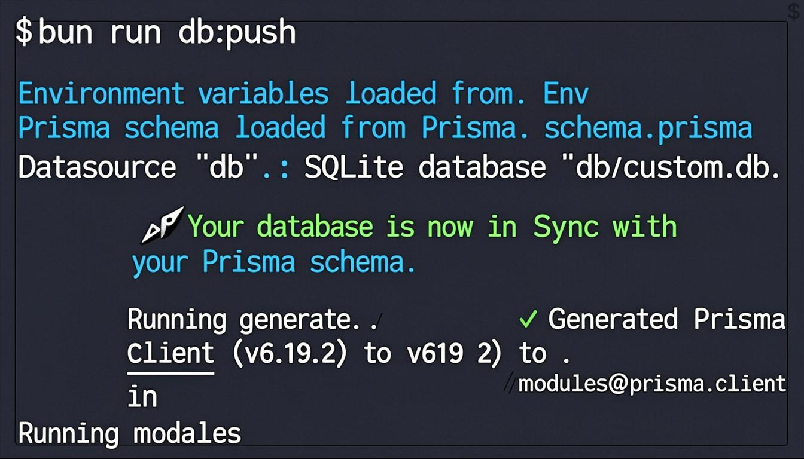

### 5.3 验证数据库文件

```bash
ls -lh db/
# 预期看到 custom.db（可能还有 custom.db-journal 临时文件）
```

### 5.4 导入演示数据（可选但推荐）

第一次部署建议导入演示数据，验证系统可用性：

```bash
bun run scripts/seed.ts
```

该脚本幂等可重复执行，仅在空库时写入。会创建：

| 数据 | 数量 | 说明 |
| --- | --- | --- |
| 分类 | 15 个 | 玄幻 / 奇幻 / 武侠 / 仙侠 / 都市 / 言情 / 历史 / 军事 / 游戏 / 科幻 / 悬疑 / 灵异 / 体育 / 轻小说 / 现实 |
| 默认站点 | 1 个 | `aurora` 主题，设为 isDefault |
| 示例规则 | 3 条 | 用于演示采集流程 |
| 演示书籍 | 6 本 | 含生成的 webp 封面 + 多章节正文 |

### 5.5 数据模型一览

系统共 11 个 Prisma 模型，覆盖采集→入库→发布全链路：

```
Category(分类) ─┐
                ├→ Book(书籍) ──→ Chapter(章节)
Rule(采集规则) ─┘                ├→ BookTag(标签)
                                └→ DownloadJob(TXT 下载任务)
Task(采集任务) ──→ Rule
                 └→ TaskLog(任务日志)

Site(站点)          # 站群配置 + TDK + 章节分页
Setting(全局设置)
FriendLink(友链)
Feedback(用户反馈)
```

---

## 6. 启动服务

### 6.1 启动 6 个 mini-services

```bash
bash mini-services/start-all.sh
```

该脚本会按顺序后台启动 6 个服务（端口 3010-3015），每启动一个会等待 ≤3 秒确认 `/health` 返回 200。预期输出：

```
[start-all] 2025-09-11 13:40:00 starting 6 mini-services...
[start-all] bqg713-proxy (port 3010): starting → .zscripts/bqg713-proxy.log
[start-all] bqg713-proxy (port 3010): OK (pid 18234)
[start-all] fetch-relay (port 3011): starting → .zscripts/fetch-relay.log
[start-all] fetch-relay (port 3011): OK (pid 18241)
[start-all] scrapling-bridge (port 3012): starting → .zscripts/scrapling-bridge.log
[start-all] scrapling-bridge (port 3012): OK (pid 18248)
[start-all] qimao-proxy (port 3013): starting → .zscripts/qimao-proxy.log
[start-all] qimao-proxy (port 3013): OK (pid 18255)
[start-all] deqixs-proxy (port 3014): starting → .zscripts/deqixs-proxy.log
[start-all] deqixs-proxy (port 3014): OK (pid 18262)
[start-all] xjp-proxy (port 3015): starting → .zscripts/xjp-proxy.log
[start-all] xjp-proxy (port 3015): OK (pid 18269)
[start-all] done. See .zscripts/*.log for details.
```

### 6.2 验证服务状态

```bash
bash mini-services/status.sh
```

预期输出（六行服务全部 `ALIVE` 且 `HEALTH=200`、`SELFTEST=true`）：

```
SERVICE              PORT    PID     PROCESS    HEALTH     SELFTEST
-----------------------------------------------------------------------------------
bqg713-proxy         3010    18234   ALIVE      200        true
fetch-relay          3011    18241   ALIVE      200        true
scrapling-bridge     3012    18248   ALIVE      200        true
qimao-proxy          3013    18255   ALIVE      200        true
deqixs-proxy         3014    18262   ALIVE      200        true
xjp-proxy            3015    18269   ALIVE      200        true

[status] All 6 services healthy.
```

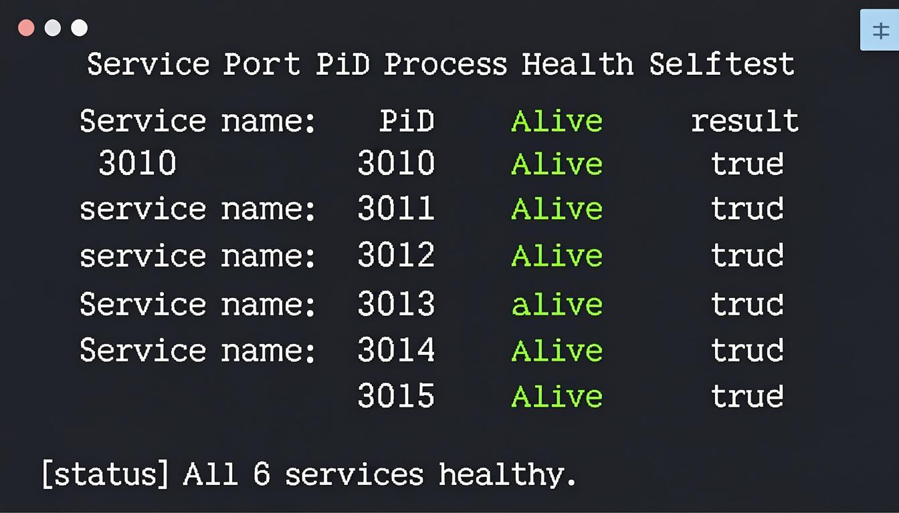

### 6.3 端口与服务对照表

| 端口 | 服务名 | 用途 | 启动目录 |
| --- | --- | --- | --- |
| 3010 | bqg713-proxy | 笔趣阁 bqg713 AES-token 外置转换代理 | `mini-services/bqg713-proxy` |
| 3011 | fetch-relay | Bun fetch 中继桥（TLS 指纹出路，支持 `RequestInit.proxy`） | `mini-services/fetch-relay` |
| 3012 | scrapling-bridge | Scrapling 桥：static / stealthy / playwright 三模式 | `mini-services/scrapling-bridge` |
| 3013 | qimao-proxy | 七猫官方 API 双签名 + 正文 AES 解密 | `mini-services/qimao-proxy` |
| 3014 | deqixs-proxy | 得奇小说网动态签名链路代理 | `mini-services/deqixs-proxy` |
| 3015 | xjp-proxy | 新键盘小说网 var c 双层正文解密代理 | `mini-services/xjp-proxy` |

> ⚠️ **安全**：6 个服务均绑定 `127.0.0.1`，请勿把 3010-3015 端口直接暴露到公网或不受信任网络。

### 6.4 启动主应用

回到项目根目录：

```bash
bun run dev
```

预期输出（约 1-3 秒后）：

```
$ bun run dev
▲ Next.js 16.1.3 (Turbopack)
- Local:        http://localhost:3000

✓ Ready in 671ms
```

打开浏览器访问 **http://localhost:3000/** 即可看到后台登录页。

### 6.5 停止服务

```bash
# 停止 mini-services
bash mini-services/stop-all.sh

# 停止主应用：在主应用终端按 Ctrl + C
```

---

## 7. 首次登录与配置

### 7.1 登录后台

浏览器访问 **http://localhost:3000/**，会看到后台登录页：

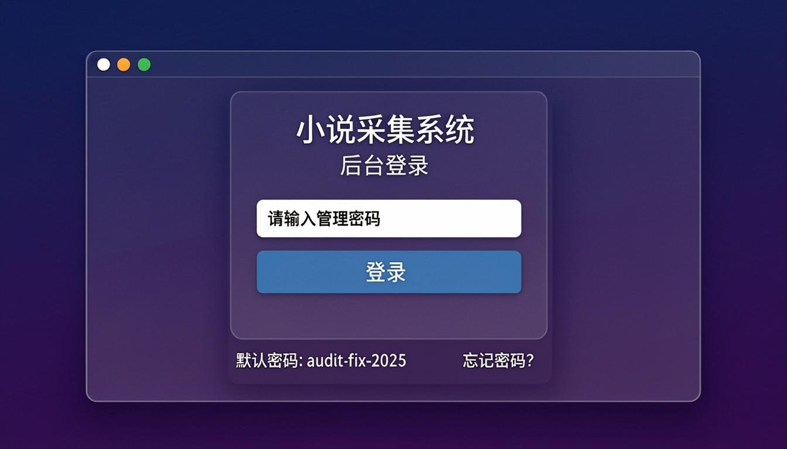

在密码输入框中输入 `.env` 里的 `ADMIN_PASSWORD` 值。如果是首次安装且未改密码，默认是：

```
audit-fix-2025
```

### 7.2 仪表盘概览

登录后自动跳转到仪表盘，顶部菜单栏共 13 个功能模块，主区会看到 4 张统计卡片（采集任务数、已采集书籍数、章节数、活跃站点数）+ 任务趋势折线图 + 分类柱状图：


### 7.3 修改登录密码（强烈建议）

1. 左侧菜单进入 **⚙️ 系统设置**
2. 找到「后台密码」输入框
3. 输入新密码（≥ 12 位）→ 点击「保存」
4. **同步修改 `.env` 中的 `ADMIN_PASSWORD`** 并重启服务（否则下次启动密码会回落到 `.env` 值）

### 7.4 后台功能导航

| 菜单 | 功能说明 |
| --- | --- |
| 📊 仪表盘 | 数据统计、图表、系统健康监控、6 个 mini-services 状态 |
| 📜 采集规则 | 配置 / 导入 / 在线测试 / 极限校准采集规则 |
| 📋 采集任务 | 创建 / 启动 / 监控 / 实时增量采集任务 |
| 📚 书籍管理 | 查看 / 编辑 / 删除 / 重新采集已入库书籍 |
| 🏷️ 分类管理 | 管理书籍分类与排序 |
| 🌐 站群系统 | 配置前台站点 + 主题 + TDK + 章节分页 |
| 🔗 友链链轮 | 管理友情链接与站群链轮 |
| 🎨 主题模板 | 浏览 50409 套主题组合 |
| 📥 TXT下载 | 生成 TXT 成品（含广告 / 站信息 / 水印） |
| 💬 用户反馈 | 查看前台用户提交的反馈 |
| 💾 数据备份 | 导出 / 导入 SQLite 数据库 |
| 🔍 SEO体检 | 站点 SEO 配置检查（TDK / sitemap / robots） |
| ⚙️ 系统设置 | TXT 默认配置 + 后台密码修改 |

---

## 8. 导入采集规则

### 8.1 规则来源

系统支持三种规则来源：

1. **模板库**（8 套预置结构模板，适合 0→1 起步）
2. **种子脚本**（34 条真实站点实测规则，幂等入库）
3. **手动配置**（在规则编辑器中从零编写，高级用户）

### 8.2 使用模板库创建规则

1. 后台 → **📜 采集规则** → 点击右上角「**模板库**」按钮
2. 弹窗展示 8 套模板，按分类筛选或搜索关键字

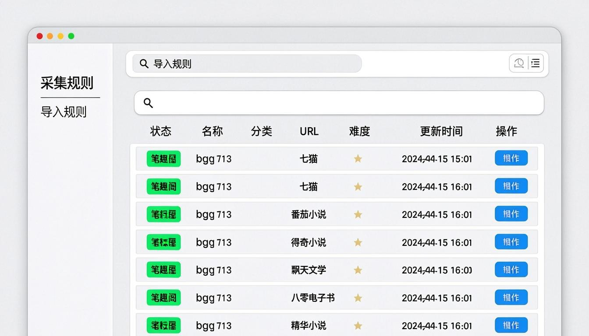

8 套预置模板：

| 模板 ID | 名称 | 适配站点 | 难度 |
| --- | --- | --- | --- |
| `biquge-standard` | 笔趣阁标准模板 | biquge 系、dedecms 改的小说站 | easy |
| `biquge-gbk` | 笔趣阁 GBK 编码模板 | 老 GBK 站点 | medium |
| `xpath-classic` | XPath 经典模板 | 论坛体、维基型站点 | medium |
| `regex-api` | 正则 + JSON API 模板 | 纯 API 返回 JSON 的站点 | medium |
| `js-rendered` | JS 渲染模板 | Vue/React SPA 站点 | hard |
| `fanqie-aggregate` | 番茄聚合模板 | 番茄小说等多源聚合站 | hard |
| `qimao-with-token` | 七猫 token 模板 | 需要 token 接口的 API 站 | hard |
| `custom-blank` | 空白模板 | 从零自定义 | - |

3. 点击模板卡片右下角「**使用此模板**」按钮
4. 系统会创建一条新规则（name 预填为「[模板] 笔趣阁标准模板」）
5. 在规则列表中点击该规则的「**编辑**」按钮，修改 `listUrl` / `bookUrl` / `host` 为目标站点真实地址
6. 点击「**测试面板**」输入真实 URL → 验证四段（列表/详情/目录/正文）解析结果

### 8.3 批量导入种子规则

模板适合起步，但要采集真实站点，建议用 `scripts/seed-rule-*.ts` 脚本批量导入。共 34 条真实规则，按需执行：

```bash
# 批量导入 24 条站点规则（batch-v2）
bun run scripts/seed-rules-batch-v2.ts

# 批量导入剩余 10 条单站规则（import-all）
bun run scripts/seed-rules-import-all.ts
```

### 8.4 导入特定规则

```bash
# 笔趣阁 bqg713（需配合 3010 端口的 bqg713-proxy 服务）
bun run scripts/seed-rule-bqg713.ts

# 七猫官方 API（需配合 3013 端口的 qimao-proxy 服务）
bun run scripts/seed-rule-qimao.ts

# 番茄小说（聚合源）
bun run scripts/seed-rule-fanqie.ts

# 飘天文学
bun run scripts/seed-rule-piaotia.ts

# 霹雳书屋（CF 挑战，需 3012 scrapling-bridge）
bun run scripts/seed-rule-pilishuwu.ts
```

> 所有 `seed-rule-*.ts` 脚本均幂等可重复执行——已存在的规则不会重复创建，已存在的字段不会被覆盖。

### 8.5 规则四段结构说明

每条规则的 `config` 字段是一个 JSON，包含四段：

```
list    → 列表页解析（每页书籍卡片 + 分页 {page} 占位符）
book    → 书籍详情页解析（书名 / 作者 / 简介 / 封面 / 完结状态）
toc     → 目录页解析（章节列表 + 分卷 + 排序）
content → 正文页解析（章节标题 + 正文 HTML + 清洗规则）
```

每段支持 5 种字段提取器：`css` / `xpath` / `regex` / `json` / `const`。可在规则编辑器中可视化调试。

---

## 9. 创建采集任务

### 9.1 通过向导创建（推荐）

1. 后台 → **📋 采集任务** → 点击右上角「**新建任务**」按钮
2. 弹出 4 步向导对话框：

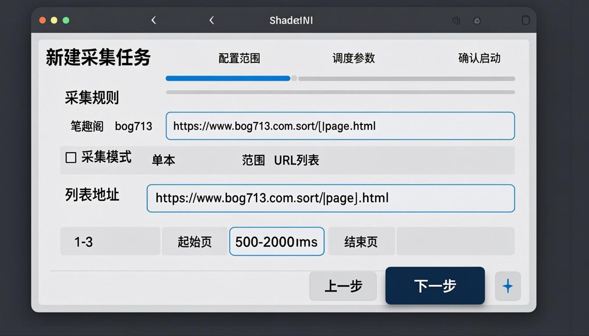

**第一步：选择采集规则**

下拉框选择已导入的规则（如「笔趣阁 bqg713」）。

**第二步：配置采集范围**

三种模式可选：

| 模式 | 适用场景 | 关键参数 |
| --- | --- | --- |
| **single（单本）** | 只采集某一本书 | `bookUrl`：书籍详情页地址 |
| **range（范围）** | 批量采集某分类下多本书 | `listUrl` 含 `{page}` 占位符 + `listStart`/`listEnd` 页码范围 |
| **urls（URL 列表）** | 已知具体书籍 URL 列表 | `urls`：一行一个 URL |

`range` 模式 `listUrl` 示例：

```
https://www.bqg713.com/sort/{page}.html
```

`{page}` 会被替换为 `listStart` 到 `listEnd` 之间的整数。

**第三步：调度参数**

| 参数 | 默认值 | 说明 |
| --- | --- | --- |
| `threadMin` / `threadMax` | 1 / 3 | 线程数随机范围（每次请求前在范围内随机取值） |
| `intervalMin` / `intervalMax` | 500 / 2000 | 间隔毫秒随机范围 |
| `storageMode` | `db` | 存储模式：`db`（数据库）/ `txt`（文本文件） |
| `recrawlMode` | `incremental` | `full`（完全覆盖重采集）/ `incremental`（仅增量更新） |
| `smartCategory` | true | 智能分类（LLM 辅助识别） |
| `smartComplete` | true | 智能判断完结状态 |
| `autoSuggest` | true | 自动生成搜索下拉词 |

**第四步：确认并启动**

检查摘要 → 点击「**启动**」按钮 → 任务状态变为 `running`。

### 9.2 增量续采

- **已完结书籍**：自动跳过，不重复采集
- **连载书籍**：检查新章节，仅采集新增部分
- **跨源去重**：同名同作者不同源的书籍会自动比较章节数，保留最完整版本

### 9.3 实时更新模式（autoRefresh）

启用后任务完成后会按 `refreshIntervalMin`（默认 30 分钟，钳 5~1440）自动重启，适合追更连载书。

---

## 10. 监控采集进度

### 10.1 任务监控面板

在 **📋 采集任务** 列表中点击任意 `running` 状态任务的「**监控**」按钮，进入实时监控面板：

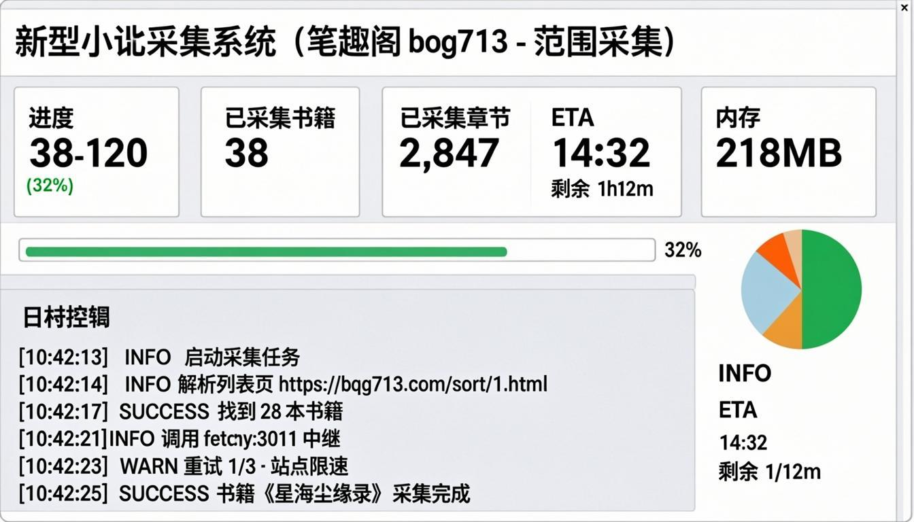

面板包含以下信息块：

| 信息块 | 字段 |
| --- | --- |
| 顶部状态栏 | 任务名 / 状态徽章（RUNNING / PAUSED / DONE / ERROR） |
| 进度卡片 | 进度 X/Y (Z%) / 已采集书籍数 / 已采集章节数 / 失败数 |
| 性能卡片 | ETA（剩余时间）/ 请求总数 / 内存占用 / 平均速率 |
| 进度条 | 横向彩色进度条 + 百分比 |
| 实时日志 | 时间戳 + 级别（INFO/SUCCESS/WARN/ERROR）+ 消息 |
| 来源分布 | 饼图：各降级链使用占比（native / curl / relay / scrapling / obscura） |

### 10.2 日志级别说明

| 级别 | 颜色 | 含义 |
| --- | --- | --- |
| INFO | 蓝色 | 流程进展信息（启动任务、解析页面、找到 N 本书） |
| SUCCESS | 绿色 | 关键节点成功（书籍采集完成、任务完成） |
| WARN | 黄色 | 警告（重试 1/3、站点限速、降级到下一引擎） |
| ERROR | 红色 | 失败（章节 404、解密失败、网络超时） |

### 10.3 任务控制

任务行右侧操作菜单提供：

- **暂停** (pause)：保留进度，可恢复
- **恢复** (resume)：从暂停点继续
- **停止** (stop)：终止任务并保存当前进度
- **导出失败书籍** (export-failed)：CSV 导出本次任务失败书籍清单
- **重试失败** (retry-failed)：仅重新采集失败书籍
- **查看快照** (snapshot)：完整任务快照 JSON
- **查看日志** (logs)：分页浏览全部日志（支持级别过滤）

### 10.4 极限校准（calibrate）

如发现任务频繁触发站点限速（429 / 403），可在 **📜 采集规则** → 该规则 → 「**极限校准**」按钮，系统会：

1. 启动一个本地 mock 站点（端口 8888），模拟三档封禁策略（轻 / 中 / 重）
2. 对真实目标站点发送递增并发探测请求
3. 找出「安全并发上限」与「安全速率」
4. 一键写回规则的 `fetchConfig.concurrency` / `interval` 字段

整个过程约 30-60 秒，详见 [docs/rule-limits.md](./rule-limits.md)。

---

## 11. 站群系统配置

### 11.1 创建新站点

后台 → **🌐 站群系统** → 「**新建站点**」按钮 → 弹出对话框：

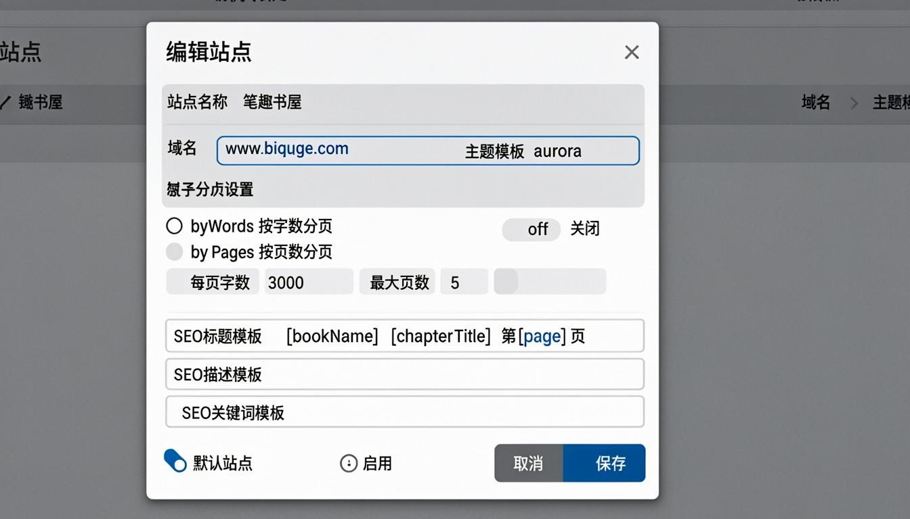

核心字段说明：

| 字段 | 说明 | 示例 |
| --- | --- | --- |
| 站点名称 | 显示在前台页脚与 sitemap | `笔趣书屋` |
| 域名 | 唯一标识，host 匹配后渲染对应站点 | `www.biquge.com` |
| 主题模板 | 主题 ID，决定首页 + 阅读页视觉 | `aurora` / `violet-glasswa-grid-cl` |
| 偏移量 (offset) | 书籍列表起始偏移，用于站群差异化 | `0` / `100` / `500` |
| 默认站点 | 前台访问 host 不匹配任何站点时渲染此站 | true / false |
| 启用 | false 时该站点不渲染 | true |
| 参与链轮 | 是否出现在其他站点的页脚友链中 | true |

### 11.2 章节分页配置

`Site` 模型支持三种章节分页模式：

| 模式 | 说明 | 参数 |
| --- | --- | --- |
| `off` | 关闭分页，整章一页显示 | 无 |
| `byWords` | 按字数分页（推荐） | `chapterPaginationWords`：每页字数（500-50000，默认 3000） |
| `byPages` | 按页数分页 | `chapterPaginationPages`：强制拆分页数（2-20，默认 3） |

分页生效后，章节 URL 自动追加 `?page=N`，前端会出现上下页导航 + 当前页/总页数指示。

### 11.3 SEO TDK 模板

每站点可配置章节页的 SEO TDK 自动生成模板，支持占位符：

| 占位符 | 含义 |
| --- | --- |
| `{bookName}` | 书名 |
| `{chapterTitle}` | 章节标题 |
| `{page}` | 当前页码 |
| `{totalPages}` | 总页数 |
| `{siteName}` | 站点名称 |

示例：

```
SEO 标题模板:  {bookName} {chapterTitle} 第{page}页 - {siteName}
SEO 描述模板:  《{bookName}》{chapterTitle}在线阅读，共{totalPages}页，当前第{page}页。{siteName}为您提供无弹窗高清阅读体验。
SEO 关键词模板: {bookName},{chapterTitle},{bookName}{chapterTitle},{siteName}
```

`chapterSeoAuto=true`（默认）时优先使用系统自动生成的 TDK，模板仅在 `false` 时生效。

### 11.4 GEO 与 ICBM

系统已内置地理定位 meta：

```
ICBM:         35.86166,104.195397  (中国坐标)
geo.region:   CN
geo.placename: 中国
```

如需修改，编辑 Site 记录的 `icbm` / `geoRegion` / `geoPlacename` 字段。

---

## 12. 主题选择

### 12.1 主题矩阵

系统内置 **50409 套主题组合**：

```
50 配色 × 42 风格 × 24 布局 = 50400 组合
+ 9 套手工调优的预设主题（aurora / pili / ocean-breeze / sunset-shelf / ...）
= 50409 套主题
```

- **配色**：50 套（暗色 / 明亮 / 玻璃拟态 / 复古 / 极简 / 赛博朋克 ...）
- **风格**：42 套（solid / gradient / transparent / split / centered / pili ...）
- **布局**：24 套（grid / list / shelf / magazine / minimal / theater / pili ...）

### 12.2 主题选择器

后台 → **🎨 主题模板** 进入主题选择器：


- **搜索框**：输入主题 ID（如 `violet-glasswa-grid-cl`）或名称关键字
- **分类筛选**：全部 / 预设 / 暗色 / 玻璃拟态 / 极简 / 复古
- **分页**：每页 12 套，共 4201 页
- **预览**：点击任意卡片放大预览首页与阅读页效果

### 12.3 URL 预览主题

不必在后台切换即可预览任意主题——前台 URL 加 `?theme=<themeId>` 参数：

```
http://localhost:3000/?view=home&theme=violet-glasswa-grid-cl
http://localhost:3000/?view=home&theme=ocean-breeze-shelf-magazine
http://localhost:3000/?view=home&theme=pili
```

满意后到 **🌐 站群系统** → 编辑站点 → 把 `主题模板` 字段改为该 themeId 即可永久应用。

### 12.4 主题 ID 命名规则

组合主题 ID 格式：`{colorId}-{styleId}-{layoutId}`

例如 `violet-glasswa-grid-cl` 表示：

- `violet` 紫色配色
- `glasswa` 玻璃拟态风格
- `grid` 网格首页布局
- `cl` classic 阅读版式

完整 50400 组合的 ID 可在主题选择器中浏览或调用 `GET /api/admin/themes` 获取。

---

## 13. 公开站点预览

### 13.1 访问前台

主应用同时承载后台与前台。前台访问方式：

```
http://localhost:3000/?site=<siteId>
# 或匹配 host 时自动渲染（开发模式可用 ?view=home）
http://localhost:3000/?view=home
```

### 13.2 前台首页


首页包含以下区块：

| 区块 | 内容 |
| --- | --- |
| 顶部导航 | 站名 logo + 分类菜单 + 搜索框 |
| 本周精选 | 3-5 本编辑推荐书籍轮播 |
| 最新上架 | 8-12 本新书卡片网格（封面 + 书名 + 作者 + 分类） |
| 热门分类 | 6 个分类入口（带书籍数量） |
| 排行榜 | 周榜 / 月榜 / 总榜（前 10） |
| 页脚 | 站点信息 + 友情链接 + 备案号占位 |

### 13.3 书籍详情页

点击任意书籍卡片进入详情页：

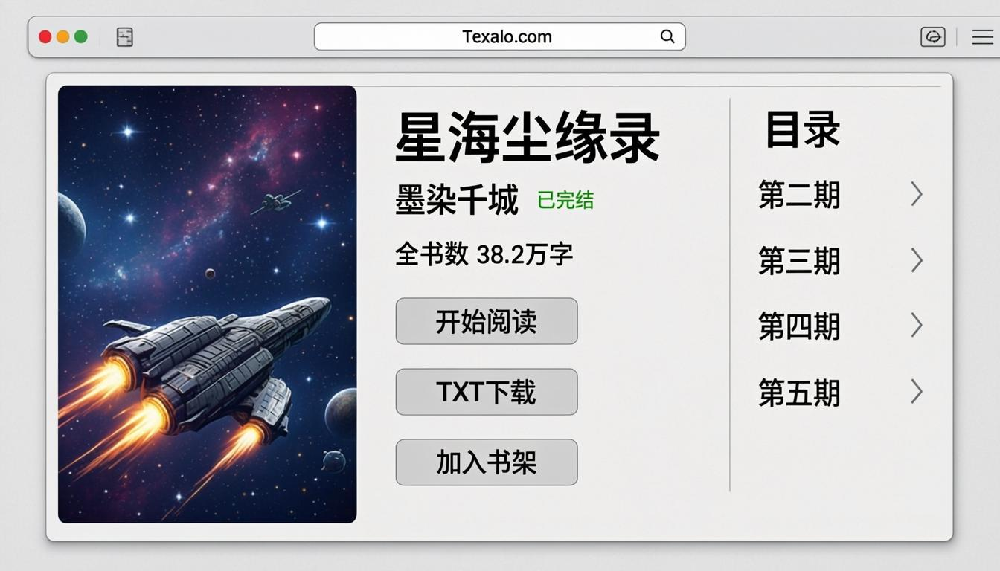

三栏布局：

| 栏 | 内容 |
| --- | --- |
| 左栏 | 大尺寸封面图 + 收藏按钮 + TXT 下载按钮 |
| 中栏 | 书名 / 作者 / 分类 / 完结状态徽章 / 字数 / 最新章节 + 简介 + 标签 |
| 右栏 | 最新章节列表（3 列 TOC，点击直达阅读页） |

### 13.4 阅读页

点击章节进入阅读页：


阅读页特性：

- 顶部工具栏：字号调节（A- A+）/ 主题切换（日间 / 夜间 / 护眼）/ 章节目录 / 阅读进度
- 主内容区：章节标题居中，正文段落清晰排版，行高 2.0
- 底部导航：上一章 / 下一章 + 章节分页（如开启 `byWords` 或 `byPages`）
- 右侧悬浮：阅读进度百分比 + 书签 / 笔记入口

### 13.5 阅读布局原型

主题 `read.layout` 字段决定阅读页视觉，4 种原型：

| 原型 | 适合 | 视觉特点 |
| --- | --- | --- |
| `classic` | 默认 | 经典典书版，居中单栏，纸面纹理可选 |
| `immersive` | 长篇沉浸阅读 | 暗色背景，宽行距，无工具条干扰 |
| `paginated` | 章节分页场景 | 横向滑动翻页，移动端友好 |
| `pili` | 霹雳书屋仿站 | 仿霹雳书屋布局，独特美学 |

### 13.6 搜索与 SEO

- **搜索**：前台 `/search?q=关键词` 调用 `/api/public/search`，支持书名 / 作者 / 标签模糊匹配，limit ≤ 50
- **Sitemap**：自动生成 `/sitemap.xml`，含 ≤ 5000 本书 + 5000 章节（每 10 分钟 HTTP 缓存）
- **Robots**：`/robots.txt` 默认允许全站索引
- **伪静态**：所有公开 URL 均为伪静态形式（`/book/<id>.html` / `/chapter/<bookId>/<idx>.html`），利于 SEO

---

## 14. Docker 一键部署（生产环境推荐）

### 14.1 前置要求

| 资源 | 最低 | 推荐 |
| --- | --- | --- |
| CPU | 1 核 | 2 核+ |
| 内存 | 2 GB | 4 GB+ |
| 磁盘 | 5 GB | 20 GB+（含采集数据） |
| 操作系统 | Linux x86_64 | Ubuntu 22.04 / Debian 12 / CentOS Stream |

### 14.2 一键部署

在已克隆的项目根目录执行：

```bash
bash install.sh
```

脚本会自动完成：

1. **检测 Docker**：缺失时询问并自动安装（国内网络自动切换阿里云 / 清华 / 中科大镜像站）
2. **配置镜像加速**：写入 `/etc/docker/daemon.json`，自检生效（可用 `SKIP_REGISTRY_MIRROR=1` 关闭）
3. **预检端口 3000**：被占用时提示并退出
4. **构建镜像**：`docker compose up -d --build`，多阶段构建（bun 构建 standalone → node:22-slim 运行）
5. **等待健康检查**：最长 5 分钟，每 15 秒探活 `/` 首页
6. **启动自动填充**（如 `AUTO_FILL=1`）：导入 7 个站点规则 + 创建「自动填充·」任务并开跑

预期输出（约 5-15 分钟，取决于网络与机器性能）：

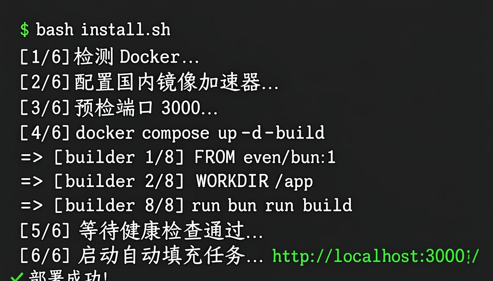

```
$ bash install.sh
[1/6] 检测 Docker... ✓ 已安装 (Docker version 24.0.7)
[2/6] 配置国内镜像加速器... ✓ 已写入 /etc/docker/daemon.json
[3/6] 预检端口 3000... ✓ 端口空闲
[4/6] docker compose up -d --build
 => [builder 1/8] FROM oven/bun:1
 => [builder 2/8] WORKDIR /app
 => [builder 8/8] RUN bun run build
 => => exporting layers
 => => writing image sha256:...
[5/6] 等待健康检查通过... ✓ (耗时 42s)
[6/6] 启动自动填充任务... ✓ 7 条规则导入完成，6 个任务已启动
✓ 部署成功!

访问地址:
  后台管理: http://localhost:3000/
  前台站点: http://localhost:3000/?view=home
```

### 14.3 远程一键部署（无需先 clone）

在任意 Linux 服务器上执行：

```bash
curl -fsSL https://raw.githubusercontent.com/u4399com-beep/heis/main/install.sh | bash
```

脚本会自动 clone 仓库到 `./novel-system` 并部署。

### 14.4 常用 Docker 命令

```bash
# 查看状态
docker compose ps

# 查看实时日志（自动填充日志带 [自动填充] 前缀）
docker compose logs -f

# 仅看主应用日志
docker compose logs -f novel-system

# 重启
docker compose restart

# 停止（数据保留在 ./db ./data）
docker compose down

# 升级
git pull
bash install.sh

# 启用 scrapling 桥（霹雳书屋等 CF 挑战站）
docker compose --profile stealthy up -d --build
```

### 14.5 修改端口

编辑 `docker-compose.yml` 中的 `ports` 字段：

```yaml
services:
  novel-system:
    ports:
      - "8080:3000"   # 改为 8080，访问 http://IP:8080
```

或临时启动时覆盖：

```bash
HOST_PORT=8080 bash install.sh
```

### 14.6 数据备份与恢复

**备份**：

```bash
docker compose down
cp -r db data /backup/$(date +%Y%m%d)/
docker compose up -d
```

**恢复**：

```bash
docker compose down
cp -r /backup/20250911/db .
cp -r /backup/20250911/data .
docker compose up -d
```

或使用后台 **💾 数据备份** 模块一键导出 SQLite 文件。

### 14.7 非 root 运行注意

镜像内以 uid 1001 非 root 运行。**首次部署后**，如出现容器内 `db/` 不可写错误（`SQLITE_READONLY`），执行：

```bash
sudo chown -R 1001:1001 ./db ./data
docker compose restart
```

---

## 15. 常见问题 FAQ

### Q1：端口被占用怎么办？

**现象**：启动时报 `Error: listen EADDRINUSE: address already in use 0.0.0.0:3000`

**排查**：

```bash
# 查看占用 3000 端口的进程
lsof -i :3000
# 或
ss -tlnp | grep 3000
```

**解决**：

```bash
# 方案 1：杀掉占用进程
kill -9 <PID>

# 方案 2：改主应用端口（开发模式）
# 编辑 package.json 的 scripts.dev:
#   "dev": "next dev -p 3001 2>&1 | tee dev.log"

# 方案 3：改 Docker 部署端口（生产模式）
# 编辑 docker-compose.yml 的 ports，左侧改为 3001:3000
```

### Q2：mini-services AUTH_TOKEN 报错？

**现象**：日志出现 `X-Bridge-Key auth failed` 或 `401 Unauthorized`

**原因**：`mini-services/_shared/server.ts` 实现了可选的 `BRIDGE_KEY` 共享密钥校验。`.env` 中设置了 `BRIDGE_KEY` 但主应用未读到，或多个服务密钥不一致。

**解决**：

```bash
# 方案 1：单机部署直接清空 BRIDGE_KEY（推荐）
echo "BRIDGE_KEY=" >> .env
# 重启所有服务
bash mini-services/stop-all.sh && bash mini-services/start-all.sh

# 方案 2：多机部署时确保所有服务读到同一密钥
# 在主应用 .env 和每个 mini-service 目录下都放同一份 .env
```

### Q3：数据库锁定（database is locked）？

**现象**：采集任务日志出现 `PrismaClientKnownRequestError: Transaction already closed: SQLITE_BUSY`

**原因**：SQLite 单写入者限制；多任务并发写入时偶发。

**解决**：

```bash
# 方案 1：降低并发线程数
# 编辑任务，将 threadMax 从 3 调到 1

# 方案 2：增加 SQLite busy_timeout（已内置默认 5000ms，可在 prisma/schema.prisma 调整）
# datasource db {
#   provider = "sqlite"
#   url      = env("DATABASE_URL")
#   relationMode = "lazy"
# }

# 方案 3：升级到 PostgreSQL（生产推荐）
# 修改 provider = "postgresql" + DATABASE_URL=postgresql://...
```

### Q4：采集时遇到 Cloudflare 挑战怎么办？

**现象**：日志出现 `403 Forbidden` + 响应 HTML 含 `Just a moment...` 或 `cf-challenge`

**解决**：

1. **启用 scrapling-bridge**（3012 端口）：
   ```bash
   cd mini-services/scrapling-bridge
   uv venv .venv && uv pip install --python .venv/bin/python 'scrapling[fetchers]'
   .venv/bin/scrapling install
   cd ../..
   bash mini-services/start-all.sh
   ```

2. **规则编辑器**中切换 `fetch.fetchMode` 为 `stealthy`（patchright 反检测浏览器 + CF 挑战求解）或 `playwright`（裸 Playwright chromium 渲染）

3. **极限情况**：启用 Obscura 隐身渲染（需先 `bunx playwright install chromium`），引擎会自动按 native → curl → relay → scrapling → obscura 顺序降级

### Q5：章节内容返回 401（登录后可见源）？

**现象**：列表与目录能抓取，但章节正文返回 401 / 重定向到登录页

**原因**：源站点要求登录后才能阅读正文

**解决**：

1. 在源站点注册账号并登录，从浏览器开发者工具拷贝 Cookie
2. 规则编辑器 → `fetch.headers` 中加入：
   ```json
   {
     "Cookie": "你的 Cookie 字符串",
     "User-Agent": "与登录时浏览器一致"
   }
   ```
3. 部分站点需要 `Referer` 链：在 `fetch.refererChain` 配置逐页伪造
4. 复杂 token 类站点（如笔趣阁 bqg713 / 七猫）已通过对应 mini-service 自动处理，无需手动配置 Cookie

### Q6：采集速度太慢？

**排查步骤**：

1. 在 **📋 采集任务** → 监控面板查看 `来源分布` 饼图：
   - 如果 80%+ 走 `native`：正常，可调高 `threadMax`（如 5）和降低 `intervalMin`（如 200）
   - 如果大量走 `curl` / `relay` / `scrapling`：源站点防护较高，慢是正常的
2. 查看 `WARN` 日志：若频繁出现 `站点限速, 退避 N 秒`，说明触发了站点反爬，需调低 `threadMax`
3. 跑一次「极限校准」（见 10.4），让系统自动找出安全并发上限
4. 启用 `smartCategory: false` 关闭 LLM 智能分类（如不需要）

### Q7：前台显示「暂无可用站点」？

**原因**：`Site` 表无记录或所有站点 `status=false`

**解决**：

1. 后台 → **🌐 站群系统** → 「新建站点」
2. 填写：站点名称 / 域名 / 主题模板（建议先用默认 `aurora`）
3. 勾选「默认站点」
4. 保存后访问 `http://localhost:3000/?view=home`

### Q8：后台密码忘记了？

**解决**：编辑 `.env` 文件，将 `ADMIN_PASSWORD` 改为新密码，重启服务：

```bash
# 本地开发
# Ctrl+C 停止 bun run dev
vim .env  # 修改 ADMIN_PASSWORD=新密码
bun run dev

# Docker 部署
docker compose down
vim .env
docker compose up -d
```

### Q9：如何修改前台主题？

三种方式任选：

1. **后台改**：站群系统 → 编辑站点 → 主题模板字段 → 选择器搜索主题 ID → 保存
2. **URL 预览**：`http://localhost:3000/?view=home&theme=violet-glasswa-grid-cl`
3. **数据库改**：直接 SQL `UPDATE Site SET themeId='新主题ID' WHERE id='站点ID'`（不推荐，绕过校验）

### Q10：Playwright 浏览器内核没装，能跑吗？

可以。引擎默认走 native fetch 链，仅在规则 `fetch.fetchMode` 显式设为 `playwright` 或 `stealthy` 时才需要浏览器内核。不安装只会影响这两个模式，触发时引擎会返回友好错误：

```
浏览器渲染引擎不可用(未安装playwright/chromium), 请使用HTTP引擎
```

按需安装：

```bash
bunx playwright install chromium
```

### Q11：Docker 部署后如何升级？

```bash
cd novel-system
git pull
bash install.sh   # 幂等，会自动重建容器，数据保留在 ./db ./data
```

### Q12：采集的书籍如何下架 / 删除？

- **单本删除**：后台 → 📚 书籍管理 → 该书 → 删除按钮（同时删除章节与本地封面）
- **批量删除**：书籍列表勾选多条 → 批量操作 → 删除
- **按规则清空**：执行 `bun run scripts/fix-dd-b-stale-task.ts`（清理某规则下所有书籍）

### Q13：如何完全卸载？

```bash
# Docker 部署
docker compose down -v
rm -rf ./db ./data ./.zscripts

# 本地开发
bash mini-services/stop-all.sh
rm -rf node_modules db data .zscripts .next
```

### Q14：哪里找更详细的部署文档？

- **[DEPLOY.md](../DEPLOY.md)**（482 行）：完整运维文档，含反向代理、SSL、备份策略、性能调优
- **[README.md](../README.md)**：项目总览与快速开始
- **[docs/rule-limits.md](./rule-limits.md)**：规则极限校准方法论
- **[worklog.md](../worklog.md)**：完整开发工作日志（含每一轮架构决策与 bug 修复记录）

---

## 📞 技术支持

- **GitHub 仓库**：https://github.com/u4399com-beep/heis
- **Issue 反馈**：https://github.com/u4399com-beep/heis/issues
- **完整部署文档**：[DEPLOY.md](../DEPLOY.md)
- **规则校准文档**：[docs/rule-limits.md](./rule-limits.md)
- **完整工作日志**：[worklog.md](../worklog.md)

---

## ⚠️ 免责声明

1. 本项目仅供**学习与研究**用途，**不得用于商业用途**。
2. 采集功能请仅用于你有权访问的目标站点，使用时请**遵守目标站点的服务条款 / robots 协议**，合理控制访问频率，勿对目标站点造成干扰。
3. 通过本项目采集到的全部内容（文字 / 封面等）**版权归原作者及原网站所有**；请勿传播、转载或转售采集所得数据。
4. 因使用本项目而产生的任何法律问题与责任，由**使用者自行承担**；项目作者与贡献者不对任何滥用行为负责。
5. 若你是站点所有者、不希望被本项目内置规则采集，请提交 issue 说明，我们会在后续版本移除对应规则。

---

*本教程适用于 heis 项目 v0.2.x 版本。如有疑问请提交 Issue，我们会持续更新。*
